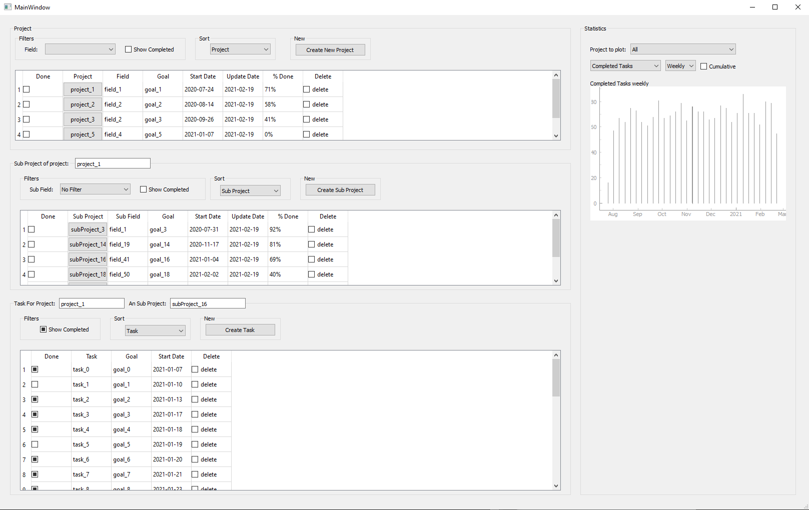

# todolist_software

This app consist on a todo list, built with pyqt5. \
You cann create and edit project, then subdivide them in sub-projects that will then contain your tasks

GUI interface

# Requierment

 * pyQt5
 * pynstaller
 * numpy / pandas

# deploy

- [ ] edit the config file
- [ ] in terminal run `pyinstaller.exe --onefile --windowed --icon=icon.ico main.py`

  
  
# Todo List

- [ ] Finish data analytics / stats
  - [ ] add graph of task_created/task_completed
  - [ ] add bar graph of most active project/sub project of last 7 days/1month (by task completed)
  
# References

* pyQt5 doc: https://doc.qt.io/qtforpython-5/PySide2/QtWidgets/index.html#module-PySide2.QtWidgets

* pyinstaller: https://www.pyinstaller.org/
